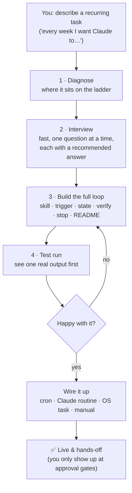
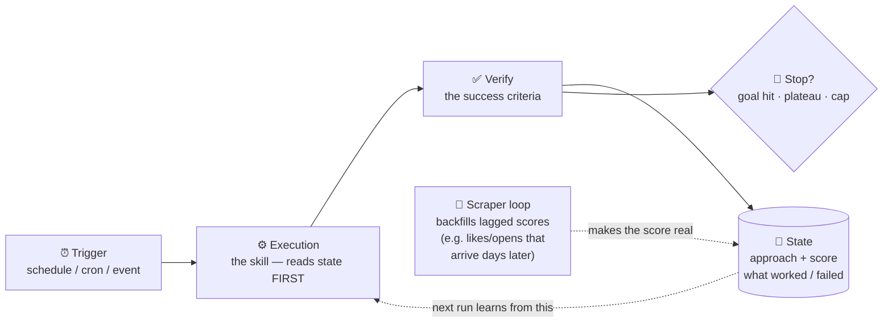
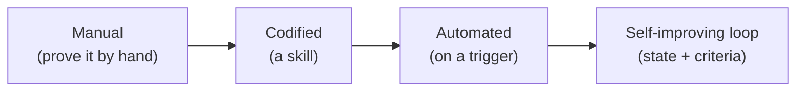

# Chase AI+ Skills

Claude Code skills for the [Chase AI+](https://www.skool.com/) community. This repo
is a **Claude Code plugin marketplace** — install once, get every skill, update with
one command.

> Access to this repo comes through the Chase AI+ classroom. Keep the link inside the
> community.

---

## Install

In Claude Code:

```
/plugin marketplace add cth9191/chase-ai-skills
/plugin install chase-ai@chase-ai-plus
```

To pull updates later:

```
/plugin marketplace update chase-ai-plus
```

**Prefer a URL?** You can point Claude Code straight at the repo instead of the
`owner/repo` shorthand — same result:

```
/plugin marketplace add https://github.com/cth9191/chase-ai-skills
```

…or just drop the repo URL into Claude Code and ask it to add the marketplace — it'll
wire it up for you.

---

## What's inside

### `loop-engineer`

An interview-driven **loop-engineering architect**. You bring a task you want to
automate; it does the hard part — the *decisions*, not just the code — then builds and
wires the whole thing.

#### What happens when you run it



It also knows when a task **shouldn't** be a loop — a one-shot (use `/goal`) or
something where success can't be defined even by a human — and says so, instead of
building a token-burner.

#### The loop it builds for you

A loop is four phases plus a stop rule. The magic is the dotted line — **each run reads
what past runs learned and gets better:**



Without **State** + the **Scraper**, a loop just repeats. With them, it *improves* —
that's the whole point.

#### Success criteria — the 5-tier ladder it forces you to pick from

"If you get nothing else right, get this right." The skill makes you choose a real one:

| Tier | What it is | Example | Automatable? |
|------|------------|---------|--------------|
| 1 | Deterministic yes/no | tests pass, compiles | ✅ fully |
| 2 | Rule / constraint | "under 200ms", "no lint errors" | ✅ fully |
| 3 | A metric / number | runtime, open rate, views | ✅ (+ scraper if lagged) |
| 4 | Fuzzy → an LLM judge | "is this good writing?" | ⚠️ judge = a *different* model |
| 5 | Needs a human | taste, brand, high-stakes | 🙋 human approval gate |

#### The maturity ladder it diagnoses you on



If your task is **unproven**, it still builds the whole loop — but bakes a **validation
gate** into run #1: the loop produces one output and waits for your thumbs-up before it
starts trusting its own scores.

**Run it:**

```
/chase-ai:loop-engineer
```

…or just describe a recurring task you want to automate and it triggers on its own.

See [`walkthrough.html`](./walkthrough.html) for a full example session, start to finish.

---

## Background

Companion to the video **"The Four Step Process to Loop Engineer ANYTHING (+ Why Prompt
Engineering Isn't Dead)."** The video teaches the theory and walks the manual setup;
this skill removes the manual labor and the decision paralysis — and wires the loop to
actually run.

---

© Chase AI. For use by Chase AI+ members. All rights reserved.
